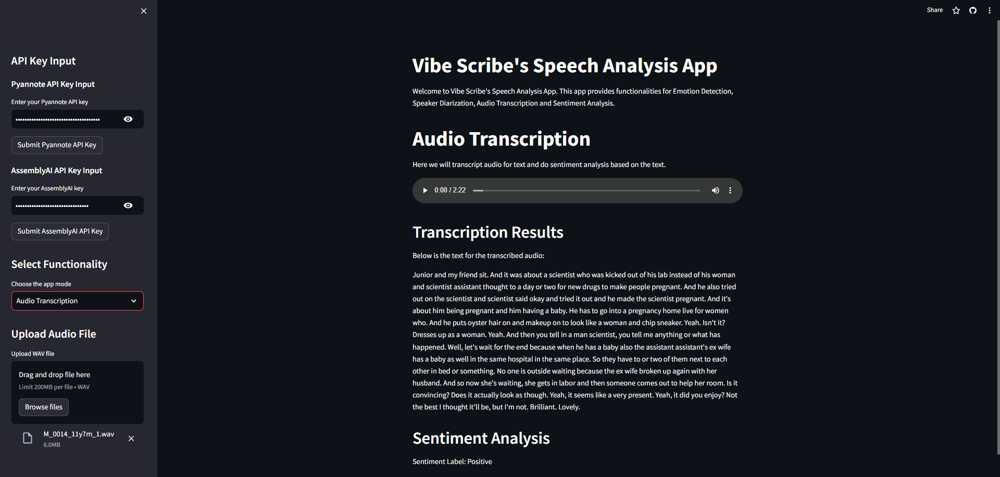

# Speech Emotion Recognition

## Table of Contents

- [Introduction](#introduction)
- [Features](#features)
- [Getting Started](#getting-started)
  - [Prerequisites](#prerequisites)
  - [Installation](#installation)
- [Data Understanding](#data-understanding)
- [Exploratory Data Analysis](#exploratory-data-analysis)
- [Modeling](#modeling)
- [Deployment](#Deployment)
- [Conclusion](#conclusion)
- [Contributing](#contributing)
- [Authors](#authors)

## Introduction

Speech Emotion Recognition (SER) is a technology that aims to automatically identify the emotional state or affective state of a speaker based on their speech signals. It involves the use of machine learning and signal-processing techniques to analyze and interpret the emotional content present in spoken language. The primary goal of Speech Emotion Recognition is to detect and classify emotions expressed by individuals during spoken communication. Emotions can include happiness, sadness, anger, pleasantly surprised and neutral.

## Features

- Data Understanding
- Data Preparation
- Exploratory Data Analysis
- Modeling (Recommendation System generation)
- User-friendly interface
- Deployed Model

## Getting Started

### Prerequisites

To run this project, you need the following prerequisites:

- Python 3.x
- Pandas
- Scikit-learn
- pyannote.audio
- joblib
- librosa

You can install these packages using pip:

        pip install pandas
        pip install scikit-learn
        pip install pyannote.audio
        pip install joblib
        pip install librosa
## Installation
Clone this repository:

        git clone https://github.com/nyaberimauti/Speech-Recognition-Project

Change to the project directory:

        cd Speech_Recognition

## Data Understanding
The data contains a collection of 200 target words spoken within the carrier phrase "Say the word _" by two actresses, aged 26 and 64 years. The recordings were captured for each of the seven emotions (anger, disgust, fear, happiness, pleasant surprise, sadness, and neutral), resulting in a total of 2800 data points (audio files).

## Exploratory Data Analysis
- Explored different emotions and their counts.
- Visualized each emotion using waveplots and spectograms
- Analyzed the amplitudes in the spectogram.

## Modeling
We utilized the following approaches: 
- Truncated Singular Value Decomposition (TruncatedVD)
The baseline model for speaker emotion detection utilizes TruncatedSVD for dimensionality reduction of the input audio features. TruncatedSVD is a technique commonly used for reducing the dimensionality of high-dimensional data while preserving important information. In this context, TruncatedSVD is applied to the Mel-Frequency Cepstral Coefficients (MFCCs) extracted from the audio recordings.

- Model Tuning
After applying TruncatedSVD for dimensionality reduction, the model is further tuned to optimize its performance. This tuning process involves parameter optimization, such as selecting the optimal number of components for TruncatedSVD and fine-tuning hyperparameters of subsequent classification models.

### Next Steps

The baseline model serves as a starting point for the speaker emotion detection task. In future iterations, more sophisticated models and techniques may be explored to improve the accuracy and robustness of the emotion detection system. Potential enhancements include incorporating deep learning architectures, refining feature extraction methods, and exploring ensemble learning techniques.

### Usage

To utilize the speaker emotion detection model, follow the instructions provided in the project documentation. The model can be applied to audio recordings to automatically detect the emotions of speakers, enabling applications in various domains such as customer service analytics, sentiment analysis in social media, and emotion-aware human-computer interaction systems.

## Conclusion

The tuned Support Vector Machine (SVM) model trained on Truncated Singular Value Decomposition (SVD) reduced features achieved promising results with a test accuracy of approximately 86.1%. The model was able to classify emotions from audio recordings with good accuracy, demonstrating its potential utility in emotion recognition tasks.

However, there is room for improvement in terms of model performance and generalization. Further refinement of the model through hyperparameter tuning, feature engineering, and data augmentation can potentially enhance its accuracy and robustness. Additionally, exploring ensemble methods and regularization techniques could lead to further improvements in model performance.

## Contributing
We welcome contributions from the community. If you'd like to contribute to this project, please follow these steps:

### Fork the repository.
1. Create a new branch for your feature:

        git checkout -b feature-name.
   
2. Make your changes and commit them:
 
       git commit -m 'Add feature-name'.
3. Push to the branch:
  
       git push origin feature-name.
   
4. Create a pull request.

## Authors
- [Lewis Kamindu](https://github.com/lewigi)
- [Winnie Pauline](https://github.com/nyaberimauti/)
- [Miriam Nguru](https://github.com/miriamnguru)
- [Celiajoy Omiah](https://github.com/celiajoyomiah)
- [John Kioko](https://github.com/johN-Kioko)
- [Brian Chacha](https://github.com/MarwaBrian)

